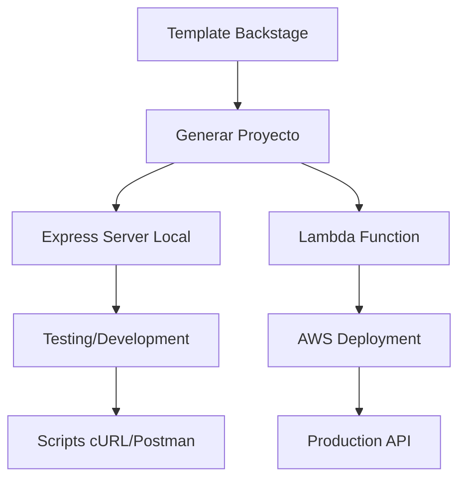

# 🚀 Apilambda-Template

**Repositorio de Templates de Backstage para AWS Lambda y DynamoDB**

[](https://aws.amazon.com/lambda/)
[](https://aws.amazon.com/dynamodb/)
[](https://backstage.io/)
[](https://nodejs.org/)

---

## 📋 Descripción

Colección de **templates de Backstage** para generar servicios serverless completos con **AWS Lambda** y **DynamoDB**. Diseñados para crear demos rápidas y prototipos de APIs CRUD robustas siguiendo arquitecturas canónicas.

### 🎯 Objetivo

Proporcionar templates parametrizables que generen:
- ✅ **Funciones Lambda** con operaciones CRUD completas
- ✅ **Integración DynamoDB** con esquemas PK/SK
- ✅ **Servidor Express** para testing local
- ✅ **Documentación automática** con TechDocs
- ✅ **Herramientas de testing** (Postman + cURL scripts)
- ✅ **Configuración Backstage** completa

---

## 📁 Estructura del Repositorio

```
Apilambda-Template/
├── README.md                                    # Este archivo
├── .gitignore                                   # Configuración Git
├── package.json                                 # Metadatos del repo
├── server.mjs                                   # Servidor ejemplo existente
├── events/                                      # Utilidades canónicas
│   ├── baseEvent.mjs                           # Evento base Lambda
│   └── buildEvent.mjs                          # Constructor de eventos
├── backstage-templates/                        # 📂 TEMPLATES DE BACKSTAGE
│   └── lambda-dynamodb-crud/                   # Template principal
│       ├── template.yaml                       # Configuración Backstage
│       ├── catalog-info.yaml                   # Metadatos del template
│       └── skeleton/                           # Contenido generado
│           ├── catalog-info.yaml               # Config del proyecto
│           ├── package.json                    # Dependencias
│           ├── server.mjs                      # Express server
│           ├── events/                         # Eventos Lambda
│           ├── {{values.functionName}}/        # Función Lambda
│           ├── docs/                           # TechDocs
│           ├── postman-collection.json         # Tests Postman
│           ├── api-test-scripts.sh             # Scripts cURL
│           └── README.md                       # Docs del proyecto
├── BackendDynamoDB/                            # DynamoDB Local setup
└── NombreFuncion/                              # Función ejemplo existente
```

---

## 🎨 Templates Disponibles

### 1. **Lambda DynamoDB CRUD**
📂 `backstage-templates/lambda-dynamodb-crud/`

**Genera un servicio serverless completo con:**

| Característica | Descripción |
|---------------|-------------|
| 🔧 **Función Lambda** | Handler CRUD completo con operaciones GET, POST, PUT, DELETE |
| 🗄️ **DynamoDB** | Esquema PK/SK parametrizable con operaciones optimizadas |
| 🖥️ **Express Server** | Servidor local que simula API Gateway para development |
| 📚 **TechDocs** | Documentación automática (API, deployment, development) |
| 🧪 **Testing Tools** | Colección Postman + Scripts cURL automatizados |
| ⚙️ **IAM Policies** | Políticas de seguridad específicas por función |
| 🔒 **Security** | Manejo seguro de credenciales y variables de entorno |

**Variables del Template:**
- `projectName`: Nombre del proyecto
- `functionName`: Nombre de la función Lambda
- `tableName`: Nombre de la tabla DynamoDB
- `entityName`: Entidad que maneja (Customer, Product, etc.)
- `baseEndpoint`: Ruta base de la API
- `enabledMethods`: Métodos HTTP soportados

---

## 🚀 Cómo Usar los Templates

### 1. **Configurar en Backstage**

```yaml
# En tu instancia de Backstage, añadir al app-config.yaml:
catalog:
  locations:
    - type: url
      target: https://github.com/tu-org/Apilambda-Template/blob/main/backstage-templates/lambda-dynamodb-crud/catalog-info.yaml
```

### 2. **Crear Nuevo Servicio**

1. **Ir a Backstage** → **Create Component**
2. **Seleccionar** "Lambda DynamoDB CRUD Service"
3. **Completar formulario**:
   - Nombre del proyecto: `customer-management`
   - Función Lambda: `CustomerManagement`
   - Tabla DynamoDB: `Customers_STD`
   - Entidad: `Customer`
   - Endpoints: `/api/customers`
4. **Generar proyecto** → ¡Listo! 🎉

### 3. **Resultado Generado**

```
customer-management/
├── CustomerManagement/          # Función Lambda
│   ├── index.mjs               # CRUD handlers
│   ├── local.mjs               # Testing wrapper
│   └── dynamo-policy.json      # IAM policies
├── server.mjs                  # Express server local
├── api-test-scripts.sh         # Scripts de testing
├── postman-collection.json     # Colección Postman
├── docs/                       # Documentación completa
└── README.md                   # Guía del proyecto
```

---

## 🛠️ Development Local

### **Ejecutar Proyecto Generado**

```bash
# 1. Instalar dependencias
npm install

# 2. Configurar DynamoDB Local
java -Djava.library.path=./DynamoDBLocal_lib -jar DynamoDBLocal.jar -sharedDb

# 3. Crear tabla
aws dynamodb create-table \
  --table-name MiTabla_STD \
  --attribute-definitions AttributeName=PK,AttributeType=S AttributeName=SK,AttributeType=S \
  --key-schema AttributeName=PK,KeyType=HASH AttributeName=SK,KeyType=RANGE \
  --provisioned-throughput ReadCapacityUnits=1,WriteCapacityUnits=1 \
  --endpoint-url http://localhost:8000

# 4. Ejecutar servidor
npm run local

# 5. Testing
./api-test-scripts.sh demo
```

### **Testing con Scripts Incluidos**

```bash
# Ver comandos disponibles
./api-test-scripts.sh help

# Demo completo CRUD
./api-test-scripts.sh demo

# Tests individuales
./api-test-scripts.sh create 123 "Mi Entidad"
./api-test-scripts.sh get 123
./api-test-scripts.sh update 123 "Actualizado"
./api-test-scripts.sh delete 123

# Test de stress
./api-test-scripts.sh stress 50
```

---

## 🏗️ Arquitectura Canónica

Los templates siguen la arquitectura establecida en este repositorio:

### **Componentes Core**

1. **Events System** (`events/`)
   - `baseEvent.mjs`: Evento base estandarizado
   - `buildEvent.mjs`: Constructor para Express → Lambda

2. **Response Handling**
   - `handleLambdaResponse()`: Manejo canónico de respuestas
   - Formato estándar: `{ statusCode, headers, body }`

3. **Error Management**
   - Mensajería consistente con `messageId` y `timestamp`
   - Códigos de error HTTP estándar
   - Logging estructurado

### **Flujo de Desarrollo**



---

## 📚 Documentación

### **Templates**
- [Lambda DynamoDB CRUD](backstage-templates/lambda-dynamodb-crud/README.md)

### **Proyectos Generados**
Cada proyecto incluye documentación completa:
- **README.md**: Guía de inicio rápido
- **docs/api.md**: Referencia de API
- **docs/deployment.md**: Guía de deployment AWS
- **docs/local-development.md**: Development local

### **TechDocs**
Integración automática con Backstage TechDocs para documentación navegable.

---

## 🧪 Testing

### **Template Testing**
```bash
# Clonar repo
git clone https://github.com/tu-org/Apilambda-Template
cd Apilambda-Template

# Testing de ejemplo existente
npm run local
```

### **Generated Project Testing**
Cada proyecto generado incluye:
- ✅ **Colección Postman** con tests automatizados
- ✅ **Scripts cURL** interactivos con colores
- ✅ **Health checks** automáticos
- ✅ **Demo CRUD** completo
- ✅ **Tests de stress** configurables

---

## 🔄 Roadmap

### **Próximas Características**

- [ ] **Template Multi-Lambda**: Monorepo con múltiples funciones
- [ ] **Template Gateway**: Agregador de servicios existentes
- [ ] **Template GraphQL**: API GraphQL con DynamoDB
- [ ] **Template EventBridge**: Arquitectura event-driven
- [ ] **Template Step Functions**: Workflows serverless
- [ ] **CI/CD Integration**: Pipelines automatizados

### **Mejoras Planeadas**

- [ ] **Testing unitario**: Framework Jest integrado
- [ ] **Monitoring**: CloudWatch dashboards automáticos
- [ ] **Security**: Escaner de vulnerabilidades
- [ ] **Performance**: Métricas y optimizaciones
- [ ] **Multi-region**: Support para múltiples regiones

---

## 🤝 Contribuir

### **Cómo Contribuir**

1. **Fork** el repositorio
2. **Crear branch**: `git checkout -b feature/nuevo-template`
3. **Desarrollar** tu template siguiendo la estructura existente
4. **Testing** completo con ejemplos
5. **Documentar** tu template
6. **Pull Request** con descripción detallada

### **Estructura de Nuevo Template**

```
backstage-templates/
└── mi-nuevo-template/
    ├── template.yaml              # Configuración Backstage
    ├── catalog-info.yaml          # Metadatos
    ├── README.md                  # Documentación
    └── skeleton/                  # Contenido a generar
        ├── catalog-info.yaml      # Config del proyecto
        ├── package.json           # Dependencias
        ├── docs/                  # TechDocs
        └── ...                    # Archivos del template
```

### **Guidelines**

- ✅ Seguir arquitectura canónica existente
- ✅ Incluir documentación completa
- ✅ Añadir herramientas de testing
- ✅ Manejar variables parametrizables
- ✅ Incluir ejemplos de uso
- ✅ Configurar políticas IAM mínimas

---

## 📞 Soporte

### **Recursos**

- **Issues**: [GitHub Issues](https://github.com/tu-org/Apilambda-Template/issues)
- **Discussions**: [GitHub Discussions](https://github.com/tu-org/Apilambda-Template/discussions)
- **Wiki**: [Project Wiki](https://github.com/tu-org/Apilambda-Template/wiki)

### **FAQ**

**Q: ¿Cómo añado un nuevo template?**
A: Sigue la estructura en `backstage-templates/` y la guía de contribución.

**Q: ¿Puedo customizar los templates existentes?**
A: Sí, haz fork y modifica según tus necesidades.

**Q: ¿Soporte para otros providers (Azure, GCP)?**
A: Actualmente solo AWS, pero contribuciones bienvenidas.

---

## 📄 Licencia

Este proyecto está bajo la Licencia **ISC**. Ver [LICENSE](LICENSE) para más detalles.

---

## 🏷️ Tags

`aws` `lambda` `dynamodb` `backstage` `serverless` `crud` `templates` `express` `nodejs` `iac` `devops` `platform-engineering`

---

**Creado con ❤️ para acelerar el desarrollo serverless**