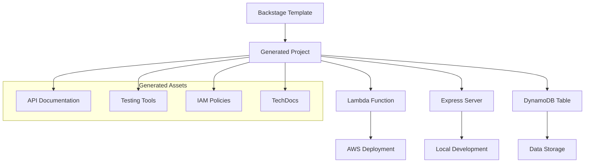

# 🚀 Apilambda-Template

**Repositorio de Templates de Backstage para AWS Lambda y DynamoDB**

---

## 🎯 Visión General

Apilambda-Template es una colección completa de **templates de Backstage** diseñados para acelerar el desarrollo de servicios serverless con **AWS Lambda** y **DynamoDB**.

### ✨ Características Principales

- 🏗️ **Templates Backstage**: Generación automática de proyectos
- ⚡ **AWS Lambda**: Funciones serverless optimizadas
- 🗄️ **DynamoDB**: Esquemas PK/SK robustos
- 🖥️ **Express Server**: Testing local integrado
- 🧪 **Testing Tools**: Postman + cURL automatizados
- 📚 **TechDocs**: Documentación automática
- 🔒 **Security**: IAM policies y best practices

---

## 🚀 Inicio Rápido

### 1. **Registrar Templates en Backstage**

```yaml
# En tu app-config.yaml
scaffolder:
  templates:
    - type: url
      target: https://github.com/Miguna/Apilambda-Template/blob/main/backstage-templates/lambda-dynamodb-crud/template.yaml
```

### 2. **Crear Nuevo Servicio**

1. Ve a **Backstage → Create Component**
2. Selecciona **"Lambda DynamoDB CRUD Service"**
3. Completa el formulario
4. ¡Genera tu proyecto! 🎉

### 3. **Development Local**

```bash
# En el proyecto generado
npm install
npm run local

# Testing automático
./api-test-scripts.sh demo
```

---

## 📦 Templates Disponibles

### 🔧 Lambda DynamoDB CRUD

Genera un servicio serverless completo con operaciones CRUD:

| Característica | Descripción |
|---------------|-------------|
| **Lambda Function** | Handler con GET, POST, PUT, DELETE |
| **DynamoDB Table** | Esquema PK/SK parametrizable |
| **Express Server** | Testing local con eventos simulados |
| **IAM Policies** | Permisos mínimos necesarios |
| **Testing Tools** | Postman collection + cURL scripts |
| **Documentation** | TechDocs automática |

**Variables del Template:**
- `projectName`: Nombre del proyecto
- `functionName`: Nombre de la función Lambda
- `tableName`: Nombre de la tabla DynamoDB
- `entityName`: Entidad que maneja
- `baseEndpoint`: Ruta base de la API
- `enabledMethods`: Métodos HTTP soportados

---

## 🏗️ Arquitectura



### 🔄 Flujo de Desarrollo

1. **Template Selection**: Elegir template en Backstage
2. **Parameter Input**: Configurar variables del proyecto
3. **Code Generation**: Generar proyecto completo
4. **Local Development**: Testing con Express server
5. **AWS Deployment**: Deploy a producción
6. **Documentation**: TechDocs automática

---

## 🧪 Testing y Calidad

### **Testing Automático**

Cada proyecto generado incluye:

- ✅ **Colección Postman** con validaciones automáticas
- ✅ **Scripts cURL** interactivos con colores
- ✅ **Health checks** automáticos
- ✅ **Demo CRUD** completo
- ✅ **Tests de stress** configurables

### **Ejemplo de Testing**

```bash
# Health check
./api-test-scripts.sh health

# Demo completo CRUD
./api-test-scripts.sh demo

# Test individual
./api-test-scripts.sh create 123 "Mi Entidad"
./api-test-scripts.sh get 123
./api-test-scripts.sh update 123 "Actualizado"

# Test de stress
./api-test-scripts.sh stress 50
```

---

## 📊 Métricas y Beneficios

### **Velocidad de Desarrollo**

| Antes | Después | Mejora |
|-------|---------|--------|
| 2-3 días setup | 15 minutos | **95% más rápido** |
| Manual documentation | Auto-generada | **100% automatizada** |
| Testing manual | Scripts incluidos | **Testing inmediato** |

### **Características de Calidad**

- 🔒 **Security**: IAM policies con permisos mínimos
- 📈 **Scalability**: Arquitectura serverless nativa
- 🔍 **Observability**: Logging estructurado
- 🧪 **Testability**: Herramientas integradas
- 📚 **Documentation**: TechDocs automática

---

## 🛣️ Roadmap

### **Próximos Templates**

- [ ] **Multi-Lambda Monorepo**: Múltiples funciones en un repo
- [ ] **GraphQL API**: API GraphQL con DynamoDB
- [ ] **EventBridge Integration**: Arquitectura event-driven
- [ ] **Step Functions**: Workflows serverless
- [ ] **API Gateway + Cognito**: Autenticación completa

### **Mejoras Planeadas**

- [ ] **CI/CD Pipelines**: GitHub Actions automáticos
- [ ] **Monitoring**: CloudWatch dashboards
- [ ] **Testing Framework**: Jest integrado
- [ ] **Multi-region**: Soporte para múltiples regiones
- [ ] **TypeScript**: Variantes en TypeScript

---

## 🤝 Contribuir

### **¿Cómo Contribuir?**

1. **Fork** el repositorio
2. **Crear branch**: `feature/nuevo-template`
3. **Desarrollar** siguiendo las convenciones
4. **Testing** completo
5. **Pull Request** con descripción

### **Convenciones**

- ✅ Seguir arquitectura canónica
- ✅ Incluir documentación completa
- ✅ Añadir herramientas de testing
- ✅ Variables parametrizables
- ✅ Políticas IAM mínimas

---

## 📞 Soporte

### **Recursos**

- 📋 **Issues**: [GitHub Issues](https://github.com/Miguna/Apilambda-Template/issues)
- 💬 **Discussions**: [GitHub Discussions](https://github.com/Miguna/Apilambda-Template/discussions)
- 📖 **Wiki**: [Project Wiki](https://github.com/Miguna/Apilambda-Template/wiki)
- 📧 **Email**: desarrollo@miguna.dev

### **Enlaces Útiles**

- [🚀 Guía de Inicio Rápido](getting-started.md)
- [🏗️ Crear Nuevos Templates](development/creating-templates.md)
- [🔧 Configuración Backstage](deployment/backstage-setup.md)
- [🧪 Testing](development/testing.md)
- [❓ Troubleshooting](reference/troubleshooting.md)

---

## 📄 Licencia

Este proyecto está bajo la **Licencia ISC**. Ver [LICENSE](https://github.com/Miguna/Apilambda-Template/blob/main/LICENSE) para más detalles.

---

**Creado con ❤️ para acelerar el desarrollo serverless**