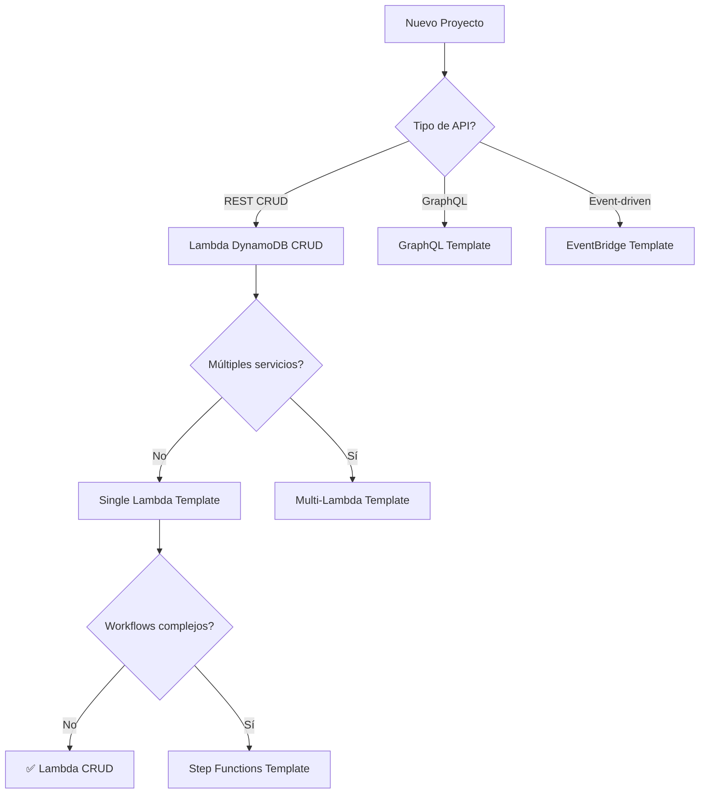

# 📦 Templates Disponibles

Colección completa de templates de Backstage para diferentes casos de uso serverless.

---

## 🔧 Lambda DynamoDB CRUD

**Template principal para servicios CRUD serverless**

### **¿Qué Genera?**

Un proyecto completo con:

- ⚡ **Función Lambda** con handlers CRUD completos
- 🗄️ **Tabla DynamoDB** con esquema PK/SK
- 🖥️ **Servidor Express** para development local
- 🧪 **Testing tools** (Postman + cURL scripts)
- 📚 **Documentación** automática con TechDocs
- 🔒 **Políticas IAM** con permisos mínimos
- 🐳 **Configuración** para deployment

### **Variables del Template**

| Variable | Descripción | Ejemplo | Requerido |
|----------|-------------|---------|-----------|
| `projectName` | Nombre del proyecto (kebab-case) | `customer-service` | ✅ |
| `description` | Descripción del servicio | `Gestión de customers` | ✅ |
| `functionName` | Nombre de la función Lambda (PascalCase) | `CustomerManagement` | ✅ |
| `tableName` | Nombre de la tabla DynamoDB | `Customers_STD` | ✅ |
| `entityName` | Nombre de la entidad | `Customer` | ✅ |
| `pkAttribute` | Nombre del Partition Key | `PK` | ❌ |
| `skAttribute` | Nombre del Sort Key | `SK` | ❌ |
| `baseEndpoint` | Ruta base de la API | `/api/customers` | ✅ |
| `enabledMethods` | Métodos HTTP habilitados | `[GET, POST, PUT, DELETE]` | ❌ |
| `repoUrl` | URL del repositorio GitHub | `github.com?owner=Miguna&repo=customer-service` | ✅ |

### **Estructura Generada**

```
customer-service/
├── CustomerManagement/          # Función Lambda
│   ├── index.mjs               # Handler principal CRUD
│   ├── local.mjs               # Wrapper para testing local
│   └── dynamo-policy.json      # Políticas IAM específicas
├── events/                     # Utilidades de eventos
│   ├── baseEvent.mjs           # Evento base Lambda
│   └── buildEvent.mjs          # Constructor de eventos
├── docs/                       # Documentación TechDocs
│   ├── index.md                # Inicio
│   ├── api.md                  # Referencia API
│   ├── deployment.md           # Guía deployment
│   └── local-development.md    # Development local
├── server.mjs                  # Servidor Express local
├── api-test-scripts.sh         # Scripts de testing cURL
├── postman-collection.json     # Colección Postman
├── package.json                # Dependencias
├── mkdocs.yml                  # Configuración docs
├── catalog-info.yaml           # Configuración Backstage
└── README.md                   # Documentación proyecto
```

### **Operaciones CRUD Generadas**

#### **GET Operations**
```bash
GET /api/customers           # Listar todos
GET /api/customers/:id       # Obtener por ID
```

#### **POST Operations**
```bash
POST /api/customers          # Crear nuevo
```

#### **PUT Operations**
```bash
PUT /api/customers/:id       # Actualizar existente
```

#### **DELETE Operations**
```bash
DELETE /api/customers/:id    # Eliminar
```

### **Ejemplo de Uso**

```bash
# Crear customer
curl -X POST "http://localhost:3002/api/customers" \
  -H "Content-Type: application/json" \
  -d '{
    "PK": "CUSTOMER#123",
    "SK": "METADATA",
    "name": "Juan Pérez",
    "email": "juan@example.com",
    "status": "active"
  }'

# Respuesta
{
  "PK": "CUSTOMER#123",
  "SK": "METADATA",
  "id": "123",
  "name": "Juan Pérez",
  "email": "juan@example.com",
  "status": "active",
  "createdAt": "2023-10-15T10:30:00Z",
  "updatedAt": "2023-10-15T10:30:00Z",
  "entityType": "Customer",
  "version": 1,
  "messageId": "uuid-123",
  "timestamp": "2023-10-15T10:30:00Z"
}
```

### **Schema DynamoDB**

```json
{
  "TableName": "Customers_STD",
  "KeySchema": [
    {
      "AttributeName": "PK",
      "KeyType": "HASH"
    },
    {
      "AttributeName": "SK",
      "KeyType": "RANGE"
    }
  ],
  "AttributeDefinitions": [
    {
      "AttributeName": "PK",
      "AttributeType": "S"
    },
    {
      "AttributeName": "SK",
      "AttributeType": "S"
    }
  ]
}
```

**Patrones de Access:**
- `PK = "CUSTOMER#<ID>"` y `SK = "METADATA"` para datos principales
- `PK = "CUSTOMER#<ID>"` y `SK = "PROFILE#<TYPE>"` para datos adicionales
- Permite consultas eficientes por customer específico

---

## 🚀 Próximos Templates

### **🏢 Multi-Lambda Monorepo** (En desarrollo)
Template para generar múltiples funciones Lambda en un solo repositorio.

**Características planeadas:**
- ✅ Múltiples funciones Lambda
- ✅ Shared libraries
- ✅ Gateway unificado
- ✅ CI/CD integrado

### **🔗 GraphQL API** (Planeado)
Template para APIs GraphQL con DynamoDB.

**Características planeadas:**
- ✅ Schema GraphQL automático
- ✅ Resolvers generados
- ✅ Subscriptions en tiempo real
- ✅ Apollo Server integrado

### **📨 EventBridge Integration** (Planeado)
Template para arquitecturas event-driven.

**Características planeadas:**
- ✅ Event schemas
- ✅ Múltiples consumers
- ✅ Dead letter queues
- ✅ Retry policies

### **🔄 Step Functions** (Planeado)
Template para workflows serverless.

**Características planeadas:**
- ✅ State machine definition
- ✅ Visual workflow
- ✅ Error handling
- ✅ Monitoring integrado

---

## 📊 Comparación de Templates

| Feature | Lambda CRUD | Multi-Lambda | GraphQL | EventBridge | Step Functions |
|---------|-------------|--------------|---------|-------------|----------------|
| **Complejidad** | Básica | Media | Media | Alta | Alta |
| **Tiempo Setup** | 15 min | 30 min | 45 min | 60 min | 60 min |
| **Use Cases** | CRUD simple | Microservicios | APIs complejas | Event-driven | Workflows |
| **Learning Curve** | Baja | Media | Media | Alta | Alta |
| **Maintenance** | Baja | Media | Media | Alta | Media |

---

## 🎯 Selección de Template

### **¿Cuándo usar Lambda DynamoDB CRUD?**

✅ **Ideal para:**
- APIs REST simples
- Prototipos rápidos
- Demos y PoCs
- Microservicios básicos
- Equipos nuevos en serverless

❌ **No usar para:**
- Aplicaciones muy complejas
- Workflows multi-step
- APIs con muchas relaciones
- Casos que requieren transacciones complejas

### **Proceso de Selección**



---

## 🛠️ Personalización

### **Modificar Templates Existentes**

1. **Fork** el repositorio
2. **Modifica** el template en `backstage-templates/`
3. **Actualiza** variables en `template.yaml`
4. **Testa** la generación
5. **Documenta** los cambios

### **Crear Nuevos Templates**

1. **Copia** la estructura de `lambda-dynamodb-crud/`
2. **Adapta** el `template.yaml`
3. **Modifica** el `skeleton/`
4. **Añade** documentación
5. **Registra** en Backstage

---

## 📚 Recursos

- [🏗️ Crear Nuevos Templates](../development/creating-templates.md)
- [🧪 Testing de Templates](../development/testing.md)
- [🔧 Configuración Backstage](../deployment/backstage-setup.md)
- [❓ Troubleshooting](../reference/troubleshooting.md)

**¿Necesitas un template específico? [Abre un issue](https://github.com/Miguna/Apilambda-Template/issues) y lo consideraremos para la próxima versión!**