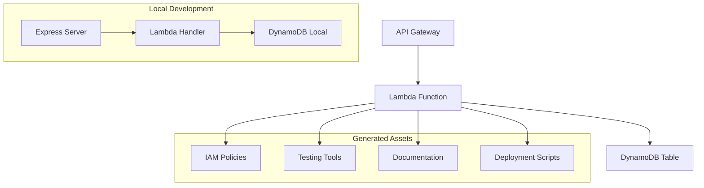

# 🔧 Lambda DynamoDB CRUD Template

Documentación completa del template principal para servicios CRUD serverless.

---

## 📖 Overview

El template **Lambda DynamoDB CRUD** es el template principal del repositorio, diseñado para generar servicios serverless completos con operaciones CRUD en DynamoDB.

### **🎯 Propósito**

- ⚡ **Acelerar desarrollo** de APIs REST serverless
- 🏗️ **Estandarizar arquitectura** Lambda + DynamoDB
- 🧪 **Incluir testing** desde el primer día
- 📚 **Documentación automática** con TechDocs
- 🔒 **Security by default** con IAM policies mínimas

---

## 🏗️ Arquitectura Generada

### **Componentes Principales**



### **Flujo de Request**

1. **API Gateway** recibe request HTTP
2. **Lambda** procesa con evento canónico
3. **DynamoDB** almacena/recupera datos
4. **Response** formato estándar JSON

### **Patrones de Diseño**

- ✅ **Single Responsibility**: Una función, una entidad
- ✅ **Event-driven**: Eventos canónicos Lambda
- ✅ **Fail-fast**: Validación temprana
- ✅ **Idempotencia**: Operations seguros para retry
- ✅ **Observability**: Logging estructurado

---

## 📝 Variables del Template

### **Información del Proyecto**

```yaml
projectName:
  title: Nombre del Proyecto
  type: string
  pattern: '^[a-z0-9-]+$'
  description: Nombre en kebab-case
  default: my-lambda-service

description:
  title: Descripción
  type: string
  description: Descripción del servicio
  default: Servicio Lambda con operaciones CRUD en DynamoDB

functionName:
  title: Nombre de la Función
  type: string
  pattern: '^[A-Z][a-zA-Z0-9]*$'
  description: Nombre en PascalCase
  default: CustomerManagement
```

### **Configuración DynamoDB**

```yaml
tableName:
  title: Nombre de la Tabla DynamoDB
  type: string
  description: Nombre de la tabla
  default: MyTable_STD

entityName:
  title: Nombre de la Entidad
  type: string
  description: Entidad que maneja el servicio
  default: Customer

pkAttribute:
  title: Atributo Partition Key
  type: string
  description: Nombre del atributo PK
  default: PK

skAttribute:
  title: Atributo Sort Key
  type: string
  description: Nombre del atributo SK
  default: SK
```

### **Configuración de Endpoints**

```yaml
baseEndpoint:
  title: Endpoint Base
  type: string
  pattern: '^/[a-z0-9/-]+$'
  description: Ruta base para los endpoints
  default: /api/customers

enabledMethods:
  title: Métodos HTTP Habilitados
  type: array
  items:
    enum: ['GET', 'POST', 'PUT', 'DELETE']
  default: ['GET', 'POST', 'PUT', 'DELETE']
  uniqueItems: true
```

---

## 🔧 Código Generado

### **Handler Lambda Principal**

```javascript
// {{values.functionName}}/index.mjs
export const handler = async (event) => {
  const { operation } = event;
  const { pathParameters, queryStringParameters, body } = event;

  switch (operation) {
    case 'list':
      return await list{{values.entityName}}s(queryStringParameters);
    case 'get':
      return await get{{values.entityName}}(pathParameters?.id);
    case 'create':
      return await create{{values.entityName}}(JSON.parse(body));
    case 'update':
      return await update{{values.entityName}}(pathParameters?.id, JSON.parse(body));
    case 'delete':
      return await delete{{values.entityName}}(pathParameters?.id);
    default:
      return errorResponse(400, `Unsupported operation: ${operation}`);
  }
};
```

### **Operaciones CRUD**

#### **CREATE Operation**
```javascript
async function create{{values.entityName}}(body) {
  const entityId = body.id || randomUUID();
  const pk = `{{values.entityName | upper}}#${entityId}`;
  const sk = body.{{values.skAttribute}} || 'METADATA';

  const item = {
    '{{values.pkAttribute}}': pk,
    '{{values.skAttribute}}': sk,
    ...body,
    id: entityId,
    createdAt: new Date().toISOString(),
    entityType: '{{values.entityName}}',
    version: 1
  };

  await dynamoDBClient.send(new PutItemCommand({
    TableName: TABLE_NAME,
    Item: marshall(item),
    ConditionExpression: 'attribute_not_exists({{values.pkAttribute}})'
  }));

  return successResponse(201, item);
}
```

#### **READ Operations**
```javascript
// Listar todos
async function list{{values.entityName}}s(queryParams) {
  const params = {
    TableName: TABLE_NAME,
    FilterExpression: 'begins_with({{values.pkAttribute}}, :entityPrefix)',
    ExpressionAttributeValues: {
      ':entityPrefix': { S: '{{values.entityName | upper}}#' }
    }
  };

  const result = await dynamoDBClient.send(new ScanCommand(params));
  const items = result.Items ? result.Items.map(item => unmarshall(item)) : [];

  return successResponse(200, { items, count: items.length });
}

// Obtener por ID
async function get{{values.entityName}}(id) {
  const params = {
    TableName: TABLE_NAME,
    Key: marshall({
      '{{values.pkAttribute}}': `{{values.entityName | upper}}#${id}`,
      '{{values.skAttribute}}': 'METADATA'
    })
  };

  const result = await dynamoDBClient.send(new GetItemCommand(params));

  if (!result.Item) {
    return errorResponse(404, '{{values.entityName}} not found');
  }

  return successResponse(200, unmarshall(result.Item));
}
```

#### **UPDATE Operation**
```javascript
async function update{{values.entityName}}(id, body) {
  const pk = `{{values.entityName | upper}}#${id}`;
  const sk = 'METADATA';

  const updateExpressions = ['#updatedAt = :updatedAt', '#version = #version + :inc'];
  const expressionAttributeNames = { '#updatedAt': 'updatedAt', '#version': 'version' };
  const expressionAttributeValues = {
    ':updatedAt': { S: new Date().toISOString() },
    ':inc': { N: '1' }
  };

  // Añadir campos del body
  Object.entries(body).forEach(([key, value]) => {
    if (key !== '{{values.pkAttribute}}' && key !== '{{values.skAttribute}}' && value !== undefined) {
      const attrName = `#${key}`;
      const attrValue = `:${key}`;
      updateExpressions.push(`${attrName} = ${attrValue}`);
      expressionAttributeNames[attrName] = key;
      expressionAttributeValues[attrValue] = marshall(value);
    }
  });

  const result = await dynamoDBClient.send(new UpdateItemCommand({
    TableName: TABLE_NAME,
    Key: marshall({ '{{values.pkAttribute}}': pk, '{{values.skAttribute}}': sk }),
    UpdateExpression: `SET ${updateExpressions.join(', ')}`,
    ExpressionAttributeNames: expressionAttributeNames,
    ExpressionAttributeValues: expressionAttributeValues,
    ConditionExpression: 'attribute_exists({{values.pkAttribute}})',
    ReturnValues: 'ALL_NEW'
  }));

  return successResponse(200, unmarshall(result.Attributes));
}
```

#### **DELETE Operation**
```javascript
async function delete{{values.entityName}}(id) {
  const pk = `{{values.entityName | upper}}#${id}`;
  const sk = 'METADATA';

  const result = await dynamoDBClient.send(new DeleteItemCommand({
    TableName: TABLE_NAME,
    Key: marshall({ '{{values.pkAttribute}}': pk, '{{values.skAttribute}}': sk }),
    ConditionExpression: 'attribute_exists({{values.pkAttribute}})',
    ReturnValues: 'ALL_OLD'
  }));

  if (!result.Attributes) {
    return errorResponse(404, '{{values.entityName}} not found');
  }

  return successResponse(204, {
    message: '{{values.entityName}} deleted successfully',
    deletedItem: unmarshall(result.Attributes)
  });
}
```

---

## 🖥️ Servidor Express Local

### **Configuración**

```javascript
// server.mjs
import express from 'express';
import { buildEvent } from './events/buildEvent.mjs';
import { handler as {{values.functionName | camelCase}} } from './{{values.functionName}}/local.mjs';

const app = express();

// Middleware
app.use(express.json());
app.use(cors());

// Logging
app.use((req, res, next) => {
  console.log(`${req.method} ${req.path}`);
  next();
});
```

### **Endpoints Generados**

```javascript


app.get('{{values.baseEndpoint}}', async (req, res) => {
  const event = buildEvent(req, { operation: 'list' });
  const result = await {{values.functionName | camelCase}}(event);
  handleLambdaResponse(result, res);
});

app.get('{{values.baseEndpoint}}/:id', async (req, res) => {
  const event = buildEvent(req, { operation: 'get' });
  const result = await {{values.functionName | camelCase}}(event);
  handleLambdaResponse(result, res);
});


app.post('{{values.baseEndpoint}}', async (req, res) => {
  const event = buildEvent(req, { operation: 'create' });
  const result = await {{values.functionName | camelCase}}(event);
  handleLambdaResponse(result, res);
});


app.put('{{values.baseEndpoint}}/:id', async (req, res) => {
  const event = buildEvent(req, { operation: 'update' });
  const result = await {{values.functionName | camelCase}}(event);
  handleLambdaResponse(result, res);
});


app.delete('{{values.baseEndpoint}}/:id', async (req, res) => {
  const event = buildEvent(req, { operation: 'delete' });
  const result = await {{values.functionName | camelCase}}(event);
  handleLambdaResponse(result, res);
});


```

---

## 🧪 Testing Tools

### **Scripts cURL Automáticos**

```bash
# api-test-scripts.sh

# Health check
./api-test-scripts.sh health

# CRUD operations
./api-test-scripts.sh create 123 "Mi {{values.entityName}}"
./api-test-scripts.sh get 123
./api-test-scripts.sh update 123 "Actualizado"
./api-test-scripts.sh delete 123

# Demo completo
./api-test-scripts.sh demo

# Test de stress
./api-test-scripts.sh stress 50
```

### **Colección Postman**

```json
{
  "info": {
    "name": "{{values.projectName | title}} API",
    "description": "{{values.description}}"
  },
  "variable": [
    { "key": "baseUrl", "value": "http://localhost:3002" },
    { "key": "entityId", "value": "001" }
  ],
  "item": [
    {
      "name": "Health Check",
      "request": {
        "method": "GET",
        "url": "{{baseUrl}}/health"
      }
    }
    // ... más requests CRUD
  ]
}
```

---

## 🔒 Security & IAM

### **Políticas IAM Generadas**

```json
{
  "Version": "2012-10-17",
  "Statement": [
    {
      "Effect": "Allow",
      "Action": [
        "dynamodb:GetItem",
        "dynamodb:PutItem",
        "dynamodb:UpdateItem",
        "dynamodb:DeleteItem",
        "dynamodb:Query",
        "dynamodb:Scan"
      ],
      "Resource": [
        "arn:aws:dynamodb:*:{{ACCOUNT_ID}}:table/{{values.tableName}}",
        "arn:aws:dynamodb:*:{{ACCOUNT_ID}}:table/{{values.tableName}}/index/*"
      ]
    },
    {
      "Effect": "Allow",
      "Action": [
        "logs:CreateLogGroup",
        "logs:CreateLogStream",
        "logs:PutLogEvents"
      ],
      "Resource": "arn:aws:logs:*:{{ACCOUNT_ID}}:log-group:/aws/lambda/{{values.functionName}}:*"
    }
  ]
}
```

### **Best Practices Implementadas**

- ✅ **Least Privilege**: Permisos mínimos necesarios
- ✅ **Resource Scoping**: Solo la tabla específica
- ✅ **Conditional Checks**: Prevenir overwrites accidentales
- ✅ **Input Validation**: Validación de tipos y formatos
- ✅ **Error Handling**: No exposure de datos sensibles

---

## 📊 Ejemplos de Uso

### **Caso 1: Customer Management**

```bash
# Configuración
projectName: customer-service
functionName: CustomerManagement
tableName: Customers_STD
entityName: Customer
baseEndpoint: /api/customers

# Uso
POST /api/customers
{
  "name": "Juan Pérez",
  "email": "juan@example.com",
  "phone": "+1234567890",
  "status": "active"
}
```

### **Caso 2: Product Catalog**

```bash
# Configuración
projectName: product-catalog
functionName: ProductManagement
tableName: Products_STD
entityName: Product
baseEndpoint: /api/products

# Uso
POST /api/products
{
  "name": "Laptop Dell",
  "category": "electronics",
  "price": 999.99,
  "stock": 50
}
```

### **Caso 3: Order Processing**

```bash
# Configuración
projectName: order-service
functionName: OrderManagement
tableName: Orders_STD
entityName: Order
baseEndpoint: /api/orders

# Uso
POST /api/orders
{
  "customerId": "CUSTOMER#123",
  "items": [{"productId": "PRODUCT#456", "quantity": 2}],
  "total": 1999.98,
  "status": "pending"
}
```

---

## 🔧 Personalización

### **Modificar Operaciones CRUD**

1. **Editar** `{{values.functionName}}/index.mjs`
2. **Añadir** validaciones específicas
3. **Customizar** esquema DynamoDB
4. **Actualizar** tests

### **Añadir Nuevos Endpoints**

1. **Modificar** `server.mjs`
2. **Añadir** handler en Lambda
3. **Actualizar** documentation
4. **Crear** tests

### **Integrar con Otros Servicios**

1. **Añadir** environment variables
2. **Configurar** IAM permissions
3. **Implementar** clients
4. **Documentar** dependencies

---

## 📚 Recursos Relacionados

- [🚀 Guía de Inicio Rápido](../getting-started.md)
- [🏗️ Crear Nuevos Templates](../development/creating-templates.md)
- [🧪 Testing](../development/testing.md)
- [🔧 Deployment](../deployment/aws-setup.md)
- [❓ Troubleshooting](../reference/troubleshooting.md)

**¿Preguntas sobre el template? [Abre un issue](https://github.com/Miguna/Apilambda-Template/issues) y te ayudamos!**